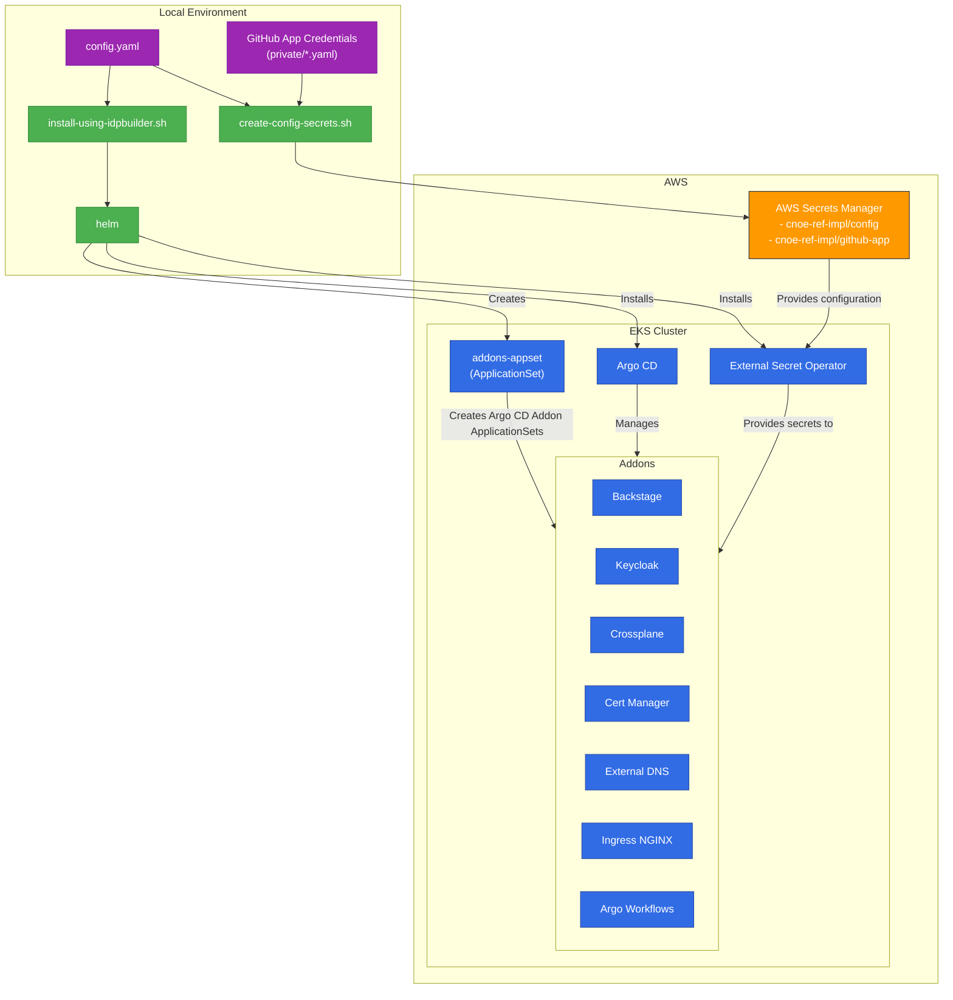
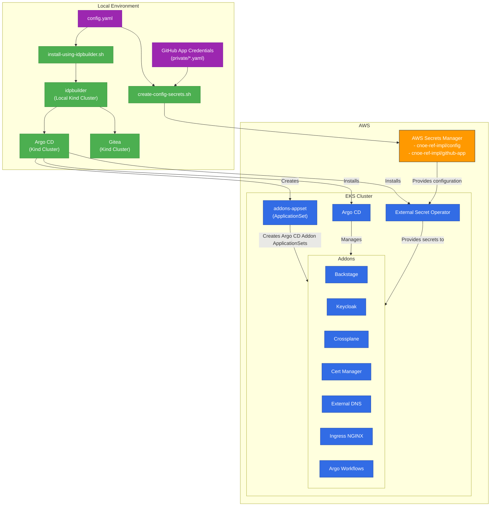

# CNOE AWS Reference Implementation

This project contains a [CNOE](https://cnoe.io) reference implementation for AWS. This project can bring up an Internal Developer Platform on EKS with all the tools configured and ready to use. It will install addons on an EKS cluster as Argo CD apps using GitOps Bridge App of ApplicationSets pattern. Check out [Getting Started](#getting-started) guide for installing this solution on EKS cluster.

> [!NOTE]
> Applications deployed in this repository are not meant or configured for production.

## Architecture Overview


## Addons

All the addons are helm charts with static values configured in `packages/<addon-name>/values.yaml` and dynamic values based on Argo CD cluster secret label/annotations values in `packages/addons/values.yaml`. 

| Name | Namespace | Purpose | Chart Version | Chart |
| ---------- | ---------- | ---------- | ---------- | ---------- | 
| Argo CD | argocd | Installation and management of addon Argo CD application | 8.0.14 | [Link](https://github.com/argoproj/argo-helm/tree/main/charts/argo-cd) |
| Argo Workflows | argo | Workflow tool for continuous integration tasks  | 0.45.18 | [Link](https://github.com/argoproj/argo-helm/tree/main/charts/argo-workflows )|
| Backstage | backstage | Self-Service Web UI (Developer Portal) for developers | 0.1.0 | [Link](packages/backstage/chart) |
| Cert Manager | cert-manager | Certificate managed for addons and developer applications using Lets Enctrypt | 1.17.2 | [Link](https://cert-manager.io/docs/installation/helm/) |
| Crossplane | crossplane-system | IaC controller for provisiong infrastructure  | 1.20.0 | [Link](https://github.com/crossplane/crossplane/tree/main/cluster/charts/crossplane) |
| External DNS | external-dns | Domain management using Route 53 | 1.16.1 | [Link](https://github.com/kubernetes-sigs/external-dns/tree/master/charts/external-dns) |
| External Secrets | external-secrets | Secret Management using AWS Secret Manager and AWS Systems Manager Parameter Store  | Version | [Link](https://github.com/external-secrets/external-secrets/tree/main/deploy/charts/external-secrets) |
| Ingress NGINX | ingress-nginx | Ingress controller for L7 network traffic routing  | 4.7.0 | [Link](https://github.com/kubernetes/ingress-nginx/tree/main/charts/ingress-nginx) |
| Keycloak | keycloak | Identity provider for User Authentication | 24.7.3 | [Link](https://github.com/bitnami/charts/tree/main/bitnami/keycloak) |

Check out more details about the [installation flow](docs/installation_flow.md).
 
## Installation Flow Diagram
This diagram illustrates the high-level installation flow for the CNOE AWS Reference Implementation. It shows how the local environment interacts with AWS resources to deploy and configure the platform on an EKS cluster.

+ **Using plain shell script**


+ **Using `idpbuilder`**


## Getting Started

> [!NOTE]
> The installation requires AWS credentials to access the EKS cluster to deploy kubernetes resources. Therefore, the installation steps can be executed on local machine or on an EC2 instance with IAM instance role. If using local machine, please use [`aws-vault`](https://github.com/99designs/aws-vault) command to run local EC2 credentials server. Find more information about this requirement in [installation flow](docs/installation_flow.md) document.

### Step 1. ☸️ Create EKS Cluster

The reference implementation can be installed on new EKS cluster which can be created with following tools:

+ **eksctl**: Follow the [instructions](cluster/eksctl)
+ **terraform**: Follow the [instructions](cluster/terraform/)  

This will create all the pre-requisite AWS Resources required for the reference implementation. Which includes:

+ EKS cluster with Auto Mode or Without Auto Mode (Managed Node Group with 4 nodes)
+ Pod Identity Associations for following Addons:

| Name | Namespace | Service Account Name | Permissions |
| ----- | --------- | -------------------- | ---------- |
| Crossplane | crossplane-system | provider-aws | Admin Permissions but with [permission boundary](cluster/iam-policies/crossplane-permissions-boundry.json) |
| External Secrets | external-secrets | external-secrets | [Permissions](https://external-secrets.io/latest/provider/aws-secrets-manager/#iam-policy) |
| External DNS | external-dns | external-dns | [Permissions](https://kubernetes-sigs.github.io/external-dns/latest/docs/tutorials/aws/#iam-policy) |
| AWS Load Balancer Controller<br>(Only for w/o Auto Mode) | kube-system | aws-load-balancer-controller | [Permissions](https://github.com/kubernetes-sigs/aws-load-balancer-controller/blob/main/docs/install/iam_policy.json) |
| AWS EBS CSI Controller<br>(Only for w/o Auto Mode) | kube-system | ebs-csi-controller-sa | [Permissions](https://docs.aws.amazon.com/aws-managed-policy/latest/reference/AmazonEBSCSIDriverPolicy.html) |
  

> [!NOTE]
> **Using Existing EKS Cluster**
> 
> The reference implementation can be installed on existing EKS Cluster only if above pre-requisites are completed.

### Step 2. 🏢 Create GitHub Organization

Backstage and Argo CD in this reference implementation are integrated with GitHub. Therefore, a GitHub Organization should be created in order to create GitHub Apps for these integrations. Follow the instructions in [GitHub documentation](https://docs.github.com/en/organizations/collaborating-with-groups-in-organizations/creating-a-new-organization-from-scratch) to create new organization.

### Step 3. 🍴 Fork the Repository

Once the organization is created, fork this repository to the new GitHub Organization by following instructions in [GitHub documentation](https://docs.github.com/en/pull-requests/collaborating-with-pull-requests/working-with-forks/fork-a-repo). 

### Step 4. 💻 Create GitHub Apps

There are two ways to create GitHub App. You can use the Backstage CLI as per instructions in [Backstage documentation](https://backstage.io/docs/integrations/github/github-apps/#using-the-cli-public-github-only), or create it manually per these instructions in [GitHub documentation](https://backstage.io/docs/integrations/github/github-apps).

Create following apps and store it in corresponding file path.

| App Name | Purpose | Required Permissions | File Path | Expected Content |
| -------- | ------- | -------------------- | --------- | ---------------- |
| Backstage | Used for automatically importing Backstage configuration such as Organization information, templates and creating new repositories for developer applications. | For All Repositories<br>- Read access to members, metadata, and organization administration<br>- Read and write access to administration and code | **`private/backstage-github.yaml`** |  |
| Argo CD | Used for deploying resources to cluster specified by Argo CD applications.| For All Repositories<br>- Read access to checks, code, members, and metadata| **`private/argocd-github.yaml`** |  |

Argo CD requires `url` and `installationId` of the GitHub app. The `url` is the GitHub URL of the organization. The `installationId` can be captured by navigating to the app installation page with URL `https://github.com/organizations/<Organization-name>/settings/installations/<ID>`. You can find more information [on this page](https://stackoverflow.com/questions/74462420/where-can-we-find-github-apps-installation-id).

> [!WARNING]
> **If the app is created using backstage CLI, it creates files in current working directory. These files contains credentials. Handle it with care. It is recommended to remove these files after copying the content over to files in `private` directory**

> [!NOTE]
> The rest of the installation process assumes the GitHub apps credentials are available in `private/backstage-github.yaml` and `private/argocd-github.yaml`

### Step 5. ⚙️ Prepare Environment for Installation

#### 📦 Install Binaries

The installation requires following binaries in the local environment:

+ [**AWS CLI**](https://docs.aws.amazon.com/cli/latest/userguide/getting-started-install.html)
+ [**Docker**](https://docs.docker.com/engine/install/)
+ [**yq**](https://mikefarah.gitbook.io/yq/v3.x)
+ [**helm**](https://helm.sh/docs/intro/install/) _(Required only if using plain shell script for installation)_
+ [**IDPBuilder**](https://github.com/cnoe-io/idpbuilder) _(Required only if using ipdbuilder for installation)_
+ [**AWS Vault**](https://github.com/99designs/aws-vault?tab=readme-ov-file#installing) _(Required only for local machine installation)_

#### 🔐 Configure AWS Credentials

If the installation steps are being executed on EC2 instance, just ensure that the EC2 IAM instance role has permissions to access EKS cluster. No other configuration is required in this case.

If the steps are being executed on a laptop/desktop, follow below steps:

1. Configure the AWS CLI with credentials of an IAM role which has access to the EKS cluster. Follow instructions in [AWS documentation](https://docs.aws.amazon.com/cli/latest/userguide/getting-started-quickstart.html#getting-started-quickstart-new) to configure AWS CLI.
2. Once AWS CLI is configured, install and start the EC2 credentials server.

   ```bash
   aws-vault exec <AWS_PROFILE> --ec2-server
   ```

3. Verify that the EC2 credentials server is started.

   ```bash
   curl -s http://169.254.169.254/latest/meta-data/iam/security-credentials/local-credentials
   ```

#### ⚙️ Configure Reference Implementation

The reference implementation uses **`config.yaml`** file in the repository root directory to pass values. Refer to following table and update all the values appropriately. All the values are required.

| Parameter | Description | Type |
|-----------|-------------|------|
| `repo.url` | GitHub URL of the fork in Github Org | string |
| `repo.revision` | Branch or Tag which should be used for Argo CD Apps | string |
| `repo.basepath` | Directory in which configuration of addons is stored | string |
| `cluster_name` | Name of the EKS cluster for reference implementation <br> **(The name should satisfy criteria of a valid [kubernetes resource name](https://kubernetes.io/docs/concepts/overview/working-with-objects/names/))** | string |
| `auto_mode` | Set to "true" if EKS cluster is Auto Mode, otherwise "false" | string |
| `region` | AWS Region of the EKS cluster and config secret | string |
| `domain` | Base Domain name for exposing services<br>**(This should be base domain or sub domain of the Route53 Hosted Zone)** | string |
| `route53_hosted_zone_id` | Route53 hosted zone ID for configuring external-dns | string |
| `path_routing` | Enable path routing ("true") vs domain-based routing ("false") | string |
| `tags` | Arbitrary key-value pairs for AWS resource tagging | object |

#### 🔒 Create Secrets in AWS Secret Manager

The values required for the installation to work are stored in AWS Secret Manager in two secrets:

1. **cnoe-ref-impl/config:** Stores values from **`config.yaml`** in JSON
2. **cnoe-ref-impl/github-app:** Stores GitHub App credentials with file name as key and content of the file as value from **private** directory.

Run below command to create new secrets or update the existing secrets if already exists.

```bash
./scripts/create-config-secrets.sh
```

> [!WARNING]
> **DO NOT** move to next steps without completing all the instructions in this step

### Step 6. 🚀 Installation

#### ▶️ Start the Installation Process

The installation can be done using plain shell script or `idpbuilder`. All the addons are installed as Argo CD apps. When using bash script, Argo CD and External Secret Operator are installed on EKS cluster as helm chart. When installing with `idpbuilder`, the Argo CD in `idpbuilder` is used install these initial addons. Once Argo CD on EKS is up, other addons are installed through it and finally the Argo CD on EKS also manages itself. Check out more details about the [installation flow](docs/installation_flow.md).

+ **Install using script:**
   ```bash
   ./scripts/install.sh
   ```

+ **Install using `idpbuilder`:**
   ```bash
   ./scripts/install-using-idpbuilder.sh
   ```

#### 📊 Monitor Installation Process

The installation script will continue to run until all the addon Argo CD apps are healthy. To monitor the process, use below instructions to access Argo CD instances. _(If using EC2 instance, make sure the port-forward from EC2 to local machine is set up)_

+ **`idpbuilder` Argo CD:** `idpbuilder` exposes its Argo CD instance at `https://cnoe.localtest.me:8443/argocd` which can be accessed through browser.

+ **EKS Argo CD:** Start the kubernetes port-forward session for Argo CD service and access the Argo CD UI in browser. In Argo CD UI, monitor the health of all Argo CD Apps

  ```bash
  kubectl port-forward -n argocd svc/argocd-server 8080:80
  ```

Depending upon the configuration, Argo CD will be accessible at http://localhost:8080 or http://localhost:8080/argocd.

Switch between the kubernetes context of idpbuilder or EKS and retrieve the credentials for Argo CD can be retrieved with following command:

```bash
kubectl get secrets -n argocd argocd-initial-admin-secret -oyaml | yq '.data.password' | base64 -d

# OR

idpbuilder get secrets -p argocd -o yaml
``` 

### Step 7. 🌐 Accessing the Platform

The addons are exposed using the base domain configured in [Step 5](#️-configure-reference-implementation). The URL depends on the setting for `path_routing`. Refer to following table for URLs:

| App Name | URL (w/ Path Routing) | URL (w/o Path Routing) |
| --------- | --------- | --------- |
| Backstage | https://[domain] | https://backstage.[domain] |
| Argo CD | https://[domain]/argocd | https://argocd.[domain] |
| Argo Workflows | https://[domain]/argo-workflows | https://argo-workflows.[domain] |

All the addons are configured with Keycloak SSO USER1 and the user password for it can be retrieved using following command:

```bash
kubectl get secrets -n keycloak keycloak-config -o go-template='{{range $k,$v := .data}}{{printf "%s: " $k}}{{if not $v}}{{$v}}{{else}}{{$v | base64decode}}{{end}}{{"\n"}}{{end}}'
``` 
Once, all the Argo CD apps on EKS cluster are reporting healthy status, try out [examples](docs/examples/) to create new application through Backstage.
For troubleshooting, refer to the [troubleshooting guide](docs/troubleshooting.md).

## Cleanup
> [!WARNING]
> Before proceeding with the cleanup, ensure any Kubernetes resource created outside of the installation process such as Argo CD Apps, deployments, volume etc. are deleted. 

Run following command to remove all the addons created by this installation:

```
./scripts/uninstall.sh
```

This script will only remove resources other than CRDs from the EKS cluster so that the same cluster can used for re-installation which is useful during development. To remove CRDs, use following command:

```
./scripts/cleanup-crds.sh
```
