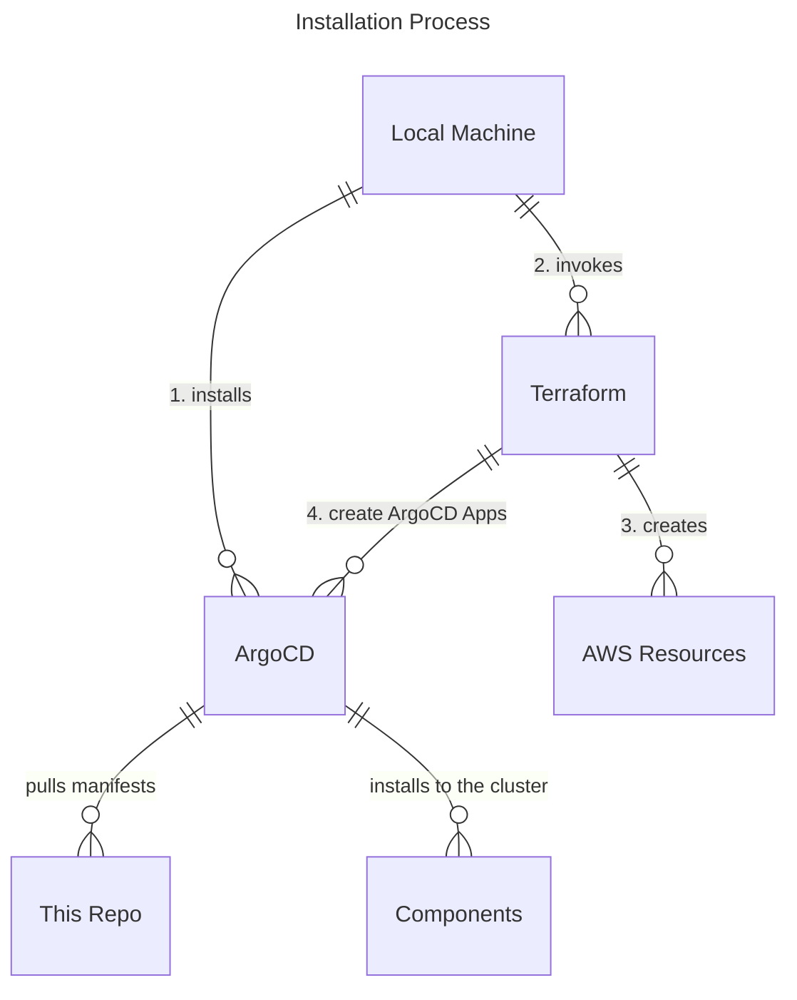

> **_NOTE:_**  Applications deployed in this repository are not meant or configured for production.


# Installation

- Installation script must be used with a EKS cluster because we use IRSA to talk to AWS services.
- Components are installed as ArgoCD Applications.
- Files under the `/packages` directory are meant to be usable without any modifications. This means certain configuration options like domain name must be passed outside of this directory. e.g. use ArgoCD's Helm parameters.

## Basic installation flow

The installation process follows the following pattern. 

1. Create a GitHub App for Backstage integration.
2. Install ArgoCD and configure it to be able to monitor your GitHub Organization.
3. Run Terraform. Terraform is responsible for:
    - Managing AWS resources necessary for the Kubernetes operators to function. Mostly IAM Roles.
    - Install components as ArgoCD applications. Pass IAM role information where necessary.
    - Apply Kubernetes manifests such as secrets and ingress where information cannot easily be passed to ArgoCD.
    - Run all the above in an order because installation order matters for many of these components. For example, Keycloak must be installed and ready before Backstage can be installed and configured.



This installation pattern where some Kubernetes manifests are handled in Terraform while others are handled in GitOps manner may not be suitable for many organizations. If you can be certain about parameters such as domain name and certificate handling, it is better to utilize GitOps approach where these information are committed to a repository. The reason it is handled this way is to allow for customization for different organizations without forking this repository and committing organization specific information into the repository. 

## Secret handling

Currently handled outside of repository and set via bash script. Secrets such as GitHub token and TLS private keys are stored in the `${REPO_ROOT}/private` directory.

We may be able to use sealed secrets with full GitOps approach in the future.

## Requirements

- Github **Organization** (free to create)
- An existing EKS cluster version (1.27+)
- AWS CLI (2.13+)
- Kubectl CLI (1.27+)
- jq
- git
- yq
- curl
- kustomize
- node + npm (if you choose to create GitHub App via CLI)

## Create GitHub Apps for your GitHub Organization

GitHub app is used to enable integration between Backstage and GitHub.
This allows you for integration actions such as automatically importing Backstage configuration such as Organization information and templates.

We strongly encourage you to create a **dedicated GitHub organization**. If you don't have an organization for this purpose, please follow [this link](https://docs.github.com/en/organizations/collaborating-with-groups-in-organizations/creating-a-new-organization-from-scratch) to create one.

There are two ways to create GitHub integration with Backstage. You can use the Backstage CLI, or create it manually. See [this page](https://backstage.io/docs/integrations/github/github-apps) for more information on creating one manually. Once the app is created, place it under the private directory with the name `github-integration.yaml`. 

To create one with the CLI, follow the steps below.

```bash
npx '@backstage/cli' create-github-app ${GITHUB_ORG_NAME}
# If prompted, select all for permissions or select permissions listed in this page https://backstage.io/docs/integrations/github/github-apps#app-permissions
# In the browser window, allow access to all repositories then install the app.

# move it to a "private" location. 
mkdir -p private
GITHUB_APP_FILE=$(ls github-app-* | head -n1)
mv ${GITHUB_APP_FILE} private/github-integration.yaml
```

**The file created above contains credentials. Handle it with care.**

The rest of the installation process assumes the GitHub app credentials are available at `private/github-integration.yaml`

If you want to delete the GitHUb application, follow [these steps](https://docs.github.com/en/apps/maintaining-github-apps/deleting-a-github-app). 
   
## Create a GitHub token

A GitHub token is needed by ArgoCD to get information about repositories under your Organization. 

The following permissions are needed: 
  - Repository access for all repositories
  - Read-only access to: Administration, Contents, and Metadata.
Get your GitHub personal access token from: https://github.com/settings/tokens?type=beta

Once you have your token, save it under the private directory with the name `github-token`. For example:

```bash
# From the root of this repository.
$ mkdir -p private
$ vim private/github-token # paste your token
# example output
$ cat private/github-token
github_pat_ABCDEDFEINDK....
```

## Install

Follow the following steps to get started.

1. Create GitHub apps and GitHub token as described above.
2. Create a new EKS cluster. We do not include EKS cluster in the installation module because EKS cluster requirements vary between organizations and the focus of this is integration of different projects. If you prefer, you can create a new basic cluster with the included [`eksctl.yaml`](./eksctl.yaml) file:
    ```eksctl create cluster -f eksctl.yaml```
    You can get eksctl from [this link](https://eksctl.io/).
3. If you don't have a public registered Route53 zone, [register a Route53 domain](https://docs.aws.amazon.com/Route53/latest/DeveloperGuide/domain-register.html) (be sure to use Route53 as the DNS service for the domain). We **strongly encourage creating a dedicated sub domain** for this. If you'd rather manage DNS yourself, you can set `enable_dns_management` in the config file.
4. Get the host zone id and put it in the config file. 
    ```bash
    aws route53 list-hosted-zones-by-name --dns-name <YOUR_DOMAIN_NAME> --query 'HostedZones[0].Id' --output text | cut -d'/' -f3
    # in the setups/config file, update the zone id.
    HOSTEDZONE_ID=ZO020111111
    ```
5. Update the [`setups/config`](setups/config.yaml) file with your own values.
6. Run `setups/install.sh` and follow the prompts. See the section below about monitoring installation progress.
7. Once installation completes, navigate to `backstage.<DOMAIN_NAME>` and log in as `user1`. Password is available as a secret. You may need to wait for DNS propagation to complete to be able to login. May take ~10 minutes.
    ```bash
    kubectl get secrets -n keycloak keycloak-user-config -o go-template='{{range $k,$v := .data}}{{printf "%s: " $k}}{{if not $v}}{{$v}}{{else}}{{$v | base64decode}}{{end}}{{"\n"}}{{end}}'
    ```


### Monitoring installation progress

Components are installed as ArgoCD Applications. You can monitor installation progress by going to ArgoCD UI. 

```bash
# Get the admin password 
kubectl -n argocd get secret argocd-initial-admin-secret -o jsonpath="{.data.password}" | base64 -d

kubectl port-forward svc/argocd-server -n argocd 8081:80
```

Go to [`http://localhost:8081`](http://localhost:8081) and login with the username `admin` and password obtained above. In the UI you can look at resources created, their logs, and events.


### If you installed it without automatic DNS configuration.

If you set `MANAGED_DNS=false`, you are responsible for updating DNS records, thus external-dns is not installed. You have to set the following DNS records:
- `backstage.<DOMAIN_NAME>`
- `keycloak.<DOMAIN_NAME>`
- `argo.<DOMAIN_NAME>`
- `argocd.<DOMAIN_NAME>`

Point these records to the value returned by the following command. 

```bash
k get svc -n ingress-nginx ingress-nginx-controller -o jsonpath='{.status.loadBalancer.ingress[0].hostname}'
```

### If you installed it without Cert Manager.

If you set `MANAGED_CERT=false`, you are responsible for managing TLS certs, thus cert-manager is not installed. You must [create TLS secrets accordingly](https://kubernetes.io/docs/concepts/services-networking/ingress/#tls).

Run the following command to find where to create secrets.

```bash
output=$(kubectl get ingress --all-namespaces -o json | jq -r '.items[] | "\(.metadata.namespace) \(.spec.rules[].host) \(.spec.tls[].secretName)"')
echo -e "Namespace \t Hostname \t TLS Secret Name"
echo -e "$output"
```

Secret format should be something like:

```yaml
apiVersion: v1
kind: Secret
metadata:
  name: backstage.<DOMAIN>
  namespace: backstage
data:
  tls.crt: <base64 encoded cert>
  tls.key: <base64 encoded key>
type: kubernetes.io/tls

```

## What was created?

The following components are installed if you chose the full installation option.

| Name | Version |
|---|---|
| argo-workflows | v3.4.8 |
| argocd | v2.7.6 |
| aws-load-balancer-controller | v2.5.3 |
| backstage | v1.16.0 |
| cert-manager | v1.12.2 |
| crossplane | v1.12.2 |
| external-dns | v0.13.5 |
| ingress-nginx | v1.8.0 |
| keycloak | v22.0.0 |
| external-secrets | v0.9.2 |

### Things created outside of the cluster

If full installation is done, you should have these DNS entries available. They all point to the Network Load Balancer.

- `backstage.<DOMAIN_NAME>` 
- `argo.<DOMAIN_NAME>`
- `keycloak.<DOMAIN_NAME>`

You can confirm these by querying at a register.

```bash
dig A `backstage.<DOMAIN_NAME>` @1.1.1.1

kubectl get svc -n ingress-nginx
```

A Network Load Balancer is also created. This is managed by the AWS Load Balancer Controller and points to ingress-nginx pod. This pod is responsible for routing requests to correct places. As a result, HTTPS endpoints are created with valid certificates.

```bash
openssl s_client -showcerts -servername id.<DOMAIN_NAME> -connect id.<DOMAIN_NAME>:443 <<< "Q"
curl https://backstage.<DOMAIN_NAME>
```

## How to access the Backstage instance?

When you open a browser window and go to `https://backstage.<DOMAIN_NAME>`, you should be prompted to login.
Two users are created during the installation process: `user1` and `user2`. Their passwords are available in the keycloak namespace.

```bash
k get secrets -n keycloak keycloak-user-config -o go-template='{{range $k,$v := .data}}{{printf "%s: " $k}}{{if not $v}}{{$v}}{{else}}{{$v | base64decode}}{{end}}{{"\n"}}{{end}}'
```

## Uninstall
1. Run `setups/uninstall.sh` and follow the prompts.
2. Remove GitHub app from your Organization by following [these steps](https://docs.github.com/en/apps/maintaining-github-apps/deleting-a-github-app).
3. Remove token from your GitHub Organization by following [these steps](https://docs.github.com/en/organizations/managing-programmatic-access-to-your-organization/reviewing-and-revoking-personal-access-tokens-in-your-organization).
4. Remove the created GitHub Organization.

<details>
    <summary>Uninstall details</summary>

### Resources deleted

Currently resources created by applications are not deleted. For example, if you have Spark Jobs running, they are not deleted and may block deletion of the spark-operator app. 

</details>

## What can you do in Backstage? 
See [this doc](./demo.md) for demos!

## Possible issues

### Cert-manager
- by default it uses http-01 challenge. If you'd prefer using dns-01, you can update the ingress files. TODO AUTOMATE THIS
- You may get events like `Get "http://<DOMAIN>/.well-known/acme-challenge/09yldI6tVRvtWVPyMfwCwsYdOCEGGVWhmb1PWzXwhXI": dial tcp: lookup <DOMAIN> on 10.100.0.10:53: no such host`. This is due to DNS propagation delay. It may take ~10 minutes.

## Troubleshooting

See [the troubleshooting doc](TROUBLESHOOTING.md) for more information.

## Creation Order notes
<details>
    <summary>Click to expand</summary>

## Things created outside of the cluster with Keycloak SSO enabled.

- Route53 records. Route53 hosted zones are not created. You must also register it if you want to be able to access through public DNS. These are managed by the external DNS controller.

- AWS Network Load Balancer. This is just the entrance to the Kubernetes cluster. This points to the default installation of Ingress Nginx and is managed by AWS Load Balancer Controller.

- TLS Certificates issued by Let's Encrypt. These are managed by cert-manager based on values in Ingress. They use the production issuer which means we must be very careful with how many and often we request certificates from them. The uninstall scripts backup certificates to the `private` directory to avoid re-issuing certificates.

These resources are controlled by Kubernetes controllers and thus should be deleted using controllers.

### Keycloak SSO with DNS and TLS certificates

If using keycloak SSO with fully automated DNS and certificate management, it must be:

1. aws-load-balancer-controller
2. ingress-nginx
3. cert-manager
4. external-dns
5.  keycloak
6. The rest of stuff


### Keycloak SSO with manual DNS and TLS Certificates

If using keycloak SSO but manage DNS records and certificates manually. 

1. aws-load-balancer-controller
2. ingress-nginx
3. The rest of stuff minus cert-manager and external-dns

In this case, you can issue your own certs and provide them as TLS secrets as specified in the `spec.tls[0].secretName` field of Ingress objects.
You can also let NLB or ALB terminate TLS instead using the LB controller. This is not covered currently, but possible.

### No SSO

If no SSO, no particular installation order. Eventual consistency works.

</details>
