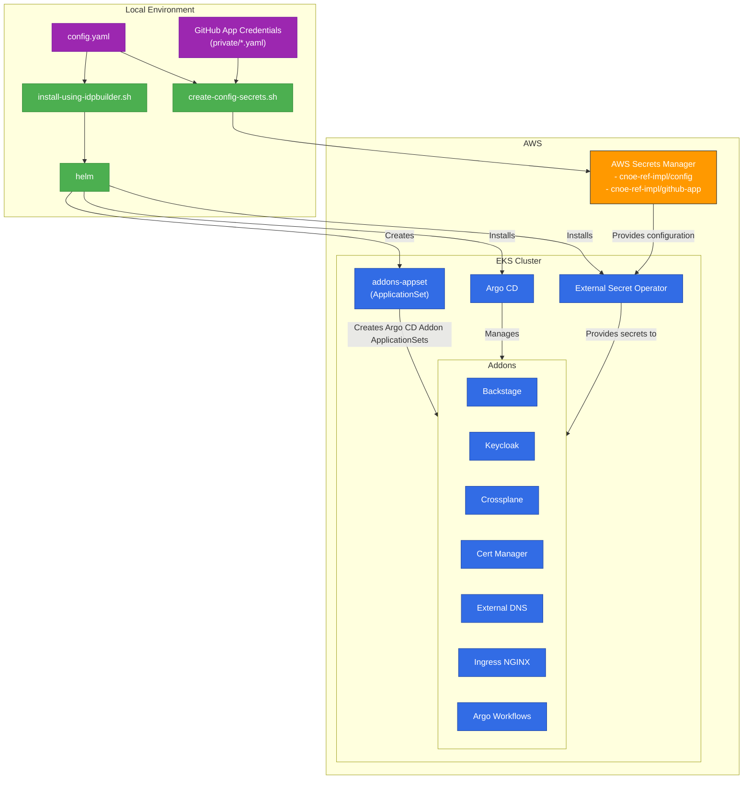
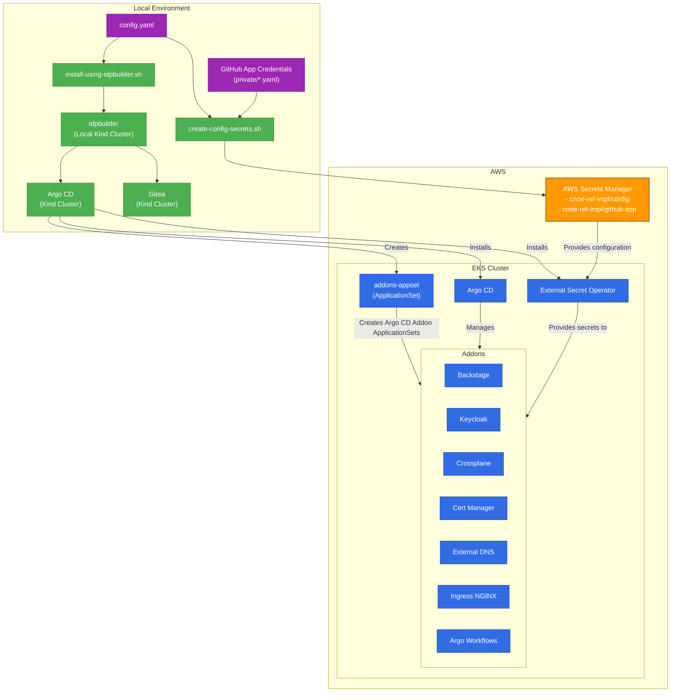

# Installation Flow

This document describes the installation flow for the CNOE AWS Reference Implementation.

## Overview

The CNOE AWS Reference Implementation uses a GitOps approach to deploy and manage addons on an EKS cluster. The installation process uses `idpbuilder` to bootstrap the EKS cluster with Argo CD and other addons.

## Flow Diagram
This diagram illustrates the high-level installation flow for the CNOE AWS Reference Implementation. It shows how the local environment interacts with AWS resources to deploy and configure the platform on an EKS cluster.

+ **Using plain shell script**

+ **Using `idpbuilder`**

## Installation Process

The installation process follows these steps:

1. **Configuration Setup**:
   - The `config.yaml` file is used to configure the installation
   - AWS Secrets Manager secrets are created to store configuration and GitHub App credentials using `create-config-secrets.sh` script

2. **Local Environment Preparation**:
   - `install.sh` script reads the `config.yaml` and based on the specified cluster name, builds a Argo CD cluster secret from eks kubeconfig.
   - `idpbuilder` creates a local Kind cluster with Argo CD, Gitea and Argo CD cluster secret for EKS cluster.
   - This local environment serves as a bootstrap mechanism for the remote EKS cluster using Argo CD in Kind cluster.

3. **EKS Cluster Bootstrap**:
   - `idpbuilder` applies Argo CD applications from the root of `packages` directory to the local Kind cluster, mainly `boostrap.yaml` and `addons-appset.yaml`.
   - Argo CD in the Kind cluster installs Argo CD and External Secret Operator on the EKS cluster. It will use AWS credentials to authenticate with EKS cluster.

4. **Addons Deployment**:
   - The `addons-appset.yaml` creates an ApplicationSet in the EKS cluster's Argo CD
   - This ApplicationSet creates individual Argo CD applicationSet for each addon using [cluster generator](https://argo-cd.readthedocs.io/en/stable/operator-manual/applicationset/Generators-Cluster/).
   - Addons are installed in a specific order to handle dependencies

5. **Addon Configuration**:
   - Addons are configured using helm values
   - Static values are stored `packages/<addon-name>/values.yaml`
   - Dynamic values from Argo CD cluster secret labels/annotations which depend on configuration from AWS Secrets Manager. 

6. **Monitoring and Verification**:
   - The installation script waits for all Argo CD applications to become healthy
   - Addons can be accessed through the configured domain based on path routing settings

## Uninstallation Process

The uninstallation process follows these steps:

1. **Remove idpbuilder Local Cluster**:
   - The local Kind cluster created by idpbuilder is deleted

2. **Remove Addons**:
   - Addons are removed in a specific order to handle dependencies
   - ApplicationSets are deleted with orphan deletion policy
   - PVCs for stateful applications are cleaned up

3. **CRD Cleanup (Optional)**:
   - Custom Resource Definitions can be cleaned up using the `cleanup-crds.sh` script
   - This is optional and useful when you want to completely remove all traces of the installation

## Key Components

1. **idpbuilder**: Creates a local Kind cluster with Argo CD and Gitea, which bootstraps the EKS cluster
2. **Argo CD**: Manages the deployment of addons on the EKS cluster using GitOps
3. **External Secret Operator**: Manages secrets from AWS Secrets Manager
4. **Addons**: Various tools and services that make up the Internal Developer Platform

## AWS Resources

The installation relies on these AWS resources:

1. **EKS Cluster**: The Kubernetes cluster where the platform is deployed
2. **AWS Secrets Manager**: Stores configuration and GitHub App credentials
3. **IAM Roles**: For pod identity associations required by various addons
4. **Route53**: For DNS management via External DNS
