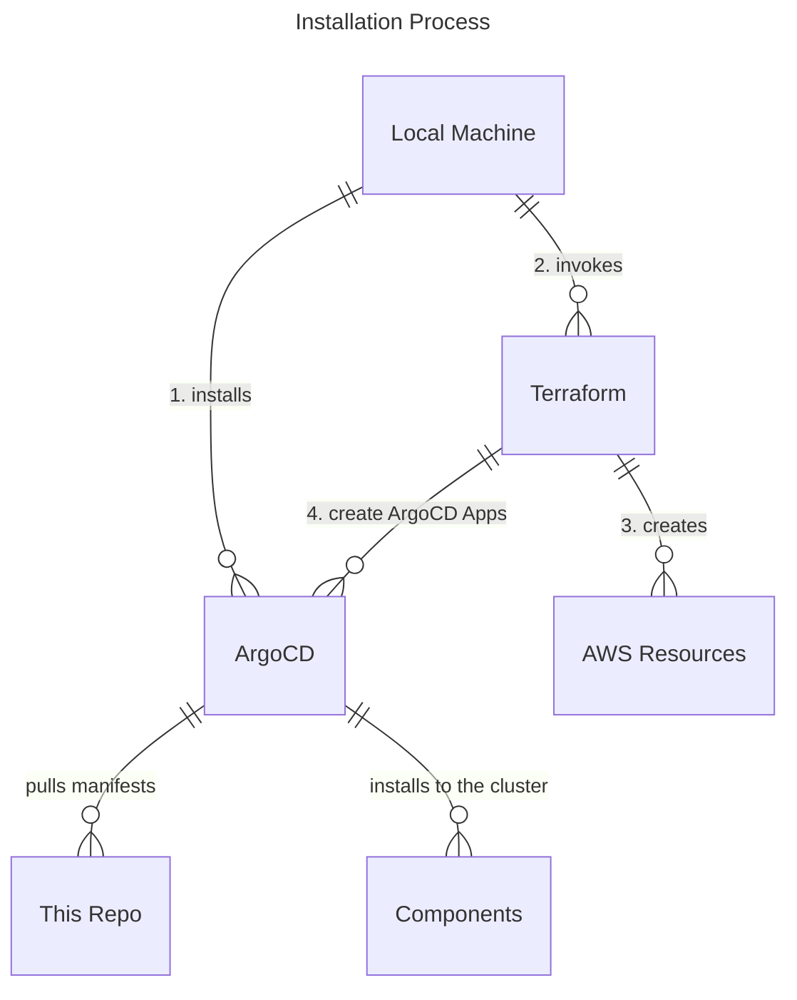

# Installation

- Installation script must be used with a EKS cluster because we use IRSA to talk to AWS services.
- Components are installed as ArgoCD Applications.
- Files under the `/packages` directory are meant to be usable without any modifications. This means certain configuration options like domain name must be passed outside of this directory. e.g. use ArgoCD's Helm parameters.

## Basic installation flow

The installation process follows the following pattern. 

1. Create a GitHub App for Backstage integration.
2. Install ArgoCD and configure it to be able to monitor your GitHub Organization.
3. Run Terraform. Terraform is responsible for:
    - Managing AWS resources necessary for the Kubernetes operators to function. Mostly IAM Roles.
    - Install components as ArgoCD applications. Pass IAM role information where necessary.
    - Apply Kubernetes manifests such as secrets and ingress where information cannot easily be passed to ArgoCD.
    - Run all the above in an order because installation order matters for many of these components. For example, Keycloak must be installed and ready before Backstage can be installed and configured.

This installation pattern where some Kubernetes manifests are handled in Terraform while others are handled in GitOps manner may not be suitable for many organizations. If you can be certain about parameters such as domain name and certificate handling, it is better to utilize GitOps approach where these information are committed to a repository. The reason it is handled this way is to allow for customization for different organizations without forking this repository and committing organization specific information into the repository.